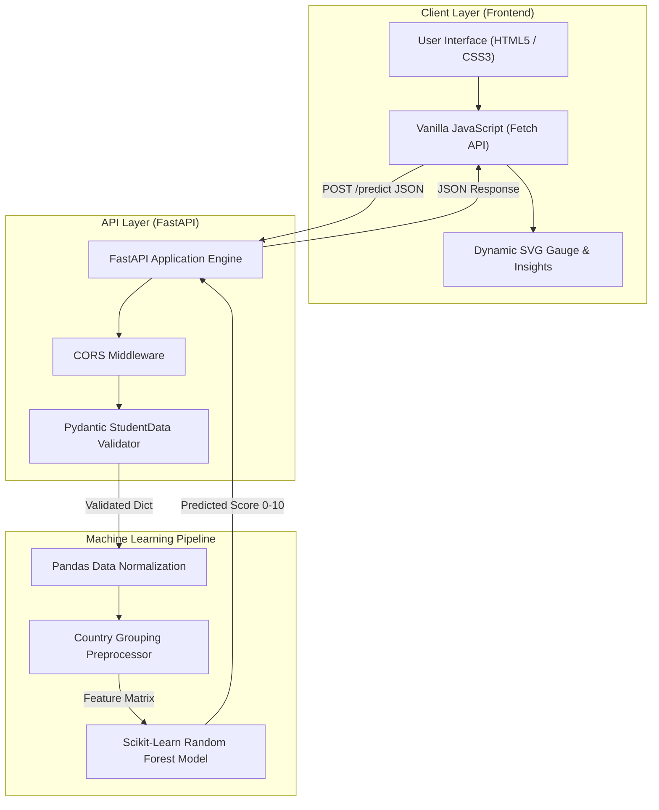
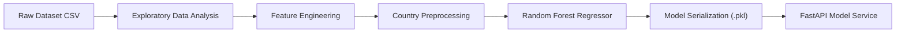

<div align="center">

# 🧠 Mental Score Predictor — Machine Learning Analytics Platform

  <p align="center">
    <strong>An end-to-end Machine Learning web application predicting student mental health well-being scores based on lifestyle, academic load, and digital engagement metrics.</strong>
  </p>

  <p align="center">
    <a href="https://mental-score-predictor.onrender.com"></a>
    <a href="https://python.org"></a>
    <a href="https://fastapi.tiangolo.com/"></a>
    <a href="https://scikit-learn.org/"></a>
    <a href="https://vitejs.dev/"></a>
    <a href="https://developer.mozilla.org/en-US/docs/Web/JavaScript"></a>
  </p>

  <h3>🌐 <a href="https://mental-score-predictor.onrender.com">Click Here to Access Live Application</a></h3>

</div>

---

## 📌 Executive Summary

**Mental Score Predictor** is a production-ready Machine Learning web application designed to evaluate and estimate a student's mental health index score on a scale of **0.00 to 10.00**.

By training Scikit-Learn Random Forest Regression models on multi-dimensional empirical data—including daily screen time, phone unlock frequencies, study schedules, sleep duration, physical activity, and self-reported stress—the platform provides instant inference, dynamic SVG visual gauge meters, factor breakdown analyses, and personalized wellness guidance.

---

## 🌐 Live Deployment URL

The application is deployed live on Render and accessible globally:

* **Live Frontend & API Web Application:** [https://mental-score-predictor.onrender.com](https://mental-score-predictor.onrender.com)
* **REST API Endpoint:** `https://mental-score-predictor.onrender.com/predict`
* **API Documentation (Swagger UI):** `https://mental-score-predictor.onrender.com/docs`

---

## ❗ Problem Statement & Machine Learning Solution

| # | Challenges in Student Well-being | Machine Learning Solution |
| :-: | :--- | :--- |
| 1 | **Unnoticed Digital Burnout** — Excessive screen usage and frequent phone unlocks degrade sleep quality and mental focus over time. | **Multi-Feature Regression Modeling**: Evaluates the cumulative impact of daily screen hours, unlock counts, and primary platforms on overall mental health scores. |
| 2 | **Lack of Quantitative Well-being Metrics** — Mental health assessment is often subjective and lacks structured index scoring. | **Standardized 0–10 Score Scale**: Outputs a precise decimal score with clear health tier classifications (Optimal, Moderate Risk, Elevated Stress Indicator). |
| 3 | **Disconnected Lifestyle Data** — Study hours, physical exercise, and sleep are rarely analyzed together as a holistic system. | **Holistic Data Preprocessing**: Combines demographic, academic, and health variables into a single feature matrix evaluated by a Random Forest Regressor. |
| 4 | **Delayed Feedback** — Traditional self-assessment tools require lengthy questionnaires with no immediate actionable insights. | **Sub-50ms REST API Inference**: Delivers instant machine learning predictions alongside tailored, automated wellness recommendations. |

---

## ✨ Key Features & Technical Highlights

* **🧠 Machine Learning Engine**: Powered by a Scikit-Learn **Random Forest Regressor** trained on real-world student lifestyle and social media usage datasets.
* **⚡ FastAPI REST API**: High-performance Python backend with asynchronous request routing, Pydantic type safety, and automatic OpenAPI validation schemas.
* **🎨 Modern Bespoke UI/UX**: Built using strict HTML5, Vanilla CSS3, and Vanilla JavaScript (ES6+), featuring glassmorphism cards, dark/light themes, and responsive grid layouts.
* **📊 Interactive SVG Gauge Meter**: Dynamic radial progress ring that animates from 0 to the exact predicted score with color-coded status badges.
* **🔍 Factor Analysis & Guidance**: Automatically calculates Screen-to-Sleep ratios, exercise sufficiency, and academic load indicators to output tailored lifestyle tips.
* **🛡️ Production CORS & Input Security**: Configured with CORS middleware to allow secure frontend-backend communication across web environments.

---

## 📐 System Architecture



---

## 📊 Machine Learning Model Pipeline



### Feature Matrix Parameters:
1. `age`: Integer (10 to 100 years)
2. `gender`: Categorical (`Male`, `Female`)
3. `country`: Categorical string (Preprocessed into top 10 countries or `Other`)
4. `academic_level`: Categorical (`High School`, `Undergraduate`, `Graduate`)
5. `most_used_platform`: Categorical (`Instagram`, `YouTube`, `TikTok`, `WhatsApp`, `LinkedIn`, `Twitter`, `Snapchat`, `Facebook`, `WeChat`, `LINE`, `KakaoTalk`, `VKontakte`)
6. `purpose_of_use`: Categorical (`Education`, `Networking`, `Entertainment`, `News`)
7. `avg_daily_usage_hours`: Float (0.0 to 24.0 hours)
8. `daily_unlocks`: Integer ($\ge 0$ unlocks/day)
9. `study_hours`: Float (0.0 to 24.0 hours)
10. `physical_activity_hours`: Float (0.0 to 24.0 hours)
11. `sleep_hours_per_night`: Float (0.0 to 24.0 hours)
12. `stress_level`: Categorical (`Low`, `Medium`, `High`, `Very High`)

---

## 📁 Repository Directory Structure

```ascii
Mental-Score-Prediction/
├── index.html                  # Main Application Single-Page Web UI
├── styles.css                  # Custom Glassmorphism Design System & CSS Variables
├── script.js                  # ES6+ Vanilla JS API Fetching, Validation & Gauge Animation
├── main.py                     # FastAPI REST Service & Scikit-Learn Model Pipeline
├── Mental_Health_Model.pkl     # Serialized Scikit-Learn Random Forest Model
├── Student Social Media...csv  # Training Dataset
├── ML_Project.ipynb            # Jupyter Notebook with EDA, Model Training & Evaluation
├── package.json                # Vite Development Server Configuration
├── requirements.txt            # Python Dependencies (FastAPI, Scikit-Learn, Uvicorn, etc.)
├── LICENSE                     # MIT Open Source License
└── README.md                   # Project Documentation
```

---

## 🔌 API Reference & Endpoint Specification

### `POST /predict`
Submits student lifestyle parameters to execute machine learning inference and returns a predicted mental health score.

#### Request Headers:
```http
Content-Type: application/json
Accept: application/json
```

#### Example Request Payload:
```json
{
  "age": 21,
  "gender": "Female",
  "country": "India",
  "academic_level": "Undergraduate",
  "most_used_platform": "Instagram",
  "purpose_of_use": "Entertainment",
  "avg_daily_usage_hours": 4.5,
  "daily_unlocks": 85,
  "study_hours": 5.5,
  "physical_activity_hours": 1.5,
  "sleep_hours_per_night": 7.0,
  "stress_level": "Medium"
}
```

#### Example 200 OK Response:
```json
{
  "predicted_mental_health_score": 6.78
}
```

#### Example 422 Unprocessable Entity Response:
```json
{
  "detail": [
    {
      "loc": ["body", "age"],
      "msg": "ensure this value is greater than or equal to 10",
      "type": "value_error.number.not_ge"
    }
  ]
}
```

---

## 🚀 Local Development Setup

### Prerequisites
* **Python 3.10+**
* **Node.js 18+** & **npm**

### 1. Clone Repository & Setup Virtual Environment
```bash
git clone https://github.com/TechRaven18/Mental-Score-Prediction.git
cd Mental-Score-Prediction

# Create and activate virtual environment
python3 -m venv .venv
source .venv/bin/activate

# Install Python dependencies
pip install -r requirements.txt
```

### 2. Start FastAPI Backend Server
```bash
uvicorn main:app --reload --port 8000
```
* The API server will start at `http://127.0.0.1:8000`
* Swagger UI documentation available at `http://127.0.0.1:8000/docs`

### 3. Start Frontend Development Server
In a separate terminal tab:
```bash
npm install
npm run dev
```
* Access the web interface at `http://localhost:5173`

---

## 📄 License

This project is open-source and available under the **MIT License**.

---

<div align="center">
  <p>Maintained by <a href="https://github.com/TechRaven18"><strong>Neeraj Sharma (@TechRaven18)</strong></a></p>
  <p>🌐 Deployed App: <a href="https://mental-score-predictor.onrender.com"><strong>https://mental-score-predictor.onrender.com</strong></a></p>
</div>